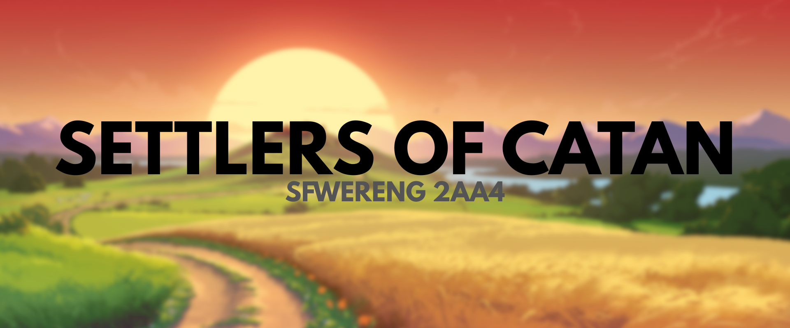

# 2AA4 Catan Game Simulation

 

**Date:** March 5th, 2026
---------------------------------------------------------

This is the repository for a Java-based Catan simulation made for the SFWRENG 2AA4 (Software Design I) course at McMaster University. 

The simulation engine runs a full game between a mix of human and computer-controlled agents, strictly enforcing the invariants defined by the official Catan rulebook (including distance rules, connection rules, and resource costs). The game is driven by a Finite State Machine (`SETUP`, `PLAYING`, `END`) and features a robust Command Line Interface (CLI) that parses human input using Regular Expressions. Furthermore, the engine uses the Decorator design pattern to silently intercept board updates and export the live game state to JSON, allowing for real-time graphical rendering via a Python visualizer.

## Functionality of the program:
- **Interactive CLI:** Allows a human player to interact with the game using natural text commands (e.g., `Build settlement 12`, `Roll`, `Go`, `List`).
- **Live Board Visualization:** Seamlessly exports the internal Java object state (Nodes, Edges, Owners) into a `TestingState.json` file to be rendered by the Python `catanatron` visualizer.
- **Rule Enforcement:** Validates all moves, preventing floating settlements, overlapping roads, or building without sufficient resources.
- **The Robber Mechanism:** Automatically triggers on a dice roll of 7, forcing players with more than 7 cards to discard half their hand, and allowing the roller to steal a random resource from an adjacent player.
- **Automated Opponents:** Computer agents dynamically assess the board state and randomly execute valid actions until a player reaches the victory point threshold.

## Directories & Files in the repository:
- `catan_game/src/main/java/com/team22/catan/board/`: Contains the axial coordinate grid system, the core `CatanBoard`, and the `VisualizerDecorator` that wraps the board to generate JSON output.
- `catan_game/src/main/java/com/team22/catan/game/`: Contains the core game loop, the `GameState` machine, the `Player` abstract architecture (`HumanPlayer`, `ComputerPlayer`), and the Regex `Parser`.
- `catan_game/src/main/java/com/team22/catan/actions/`: Implements the Command design pattern, encapsulating every possible player move (`BuildRoad`, `GenerateResources`, `EndTurn`) into distinct executable classes.
- `catan_game/src/main/java/com/team22/catan/structures/`: Contains the abstract representations of `City`, `Settlement`, and `Road`, detailing their resource costs and victory point values.
- `assignments/visualize/`: The target directory for the Python visualizer, containing `base_map.json` and the dynamically updated `TestingState.json`.
- `catan_game/res/`: Contains the `config.properties` file where the main settings for the game (winning VP, RNG seed, turns) are defined.

# Assignment 2 Checklist

## Technical content
- [x] Every task in the assignment addressed
- [x] Human player integrated (R2.1)
- [x] Step forward / `Go` functionality implemented (R2.4)
- [x] Robber mechanism implemented (R2.5)

## Delivery

### Software
- [x] Requirements addressed
- [x] Software properly tested (JUnit Boundary/Partition testing)
- [x] Demonstrator implemented and documented
- [x] Visualizer integration works seamlessly without crashing

### Management
- [x] SonarQube analysis linked in the README file
- [x] Kanban board maintained and publicly available
- [x] Commits linked to work items 
- [x] Deliverable tagged in Git

### Report
- [x] Reflection points elaborated (OO design, SOLID principles, Automata)
- [x] Report written
- [x] Report submitted
