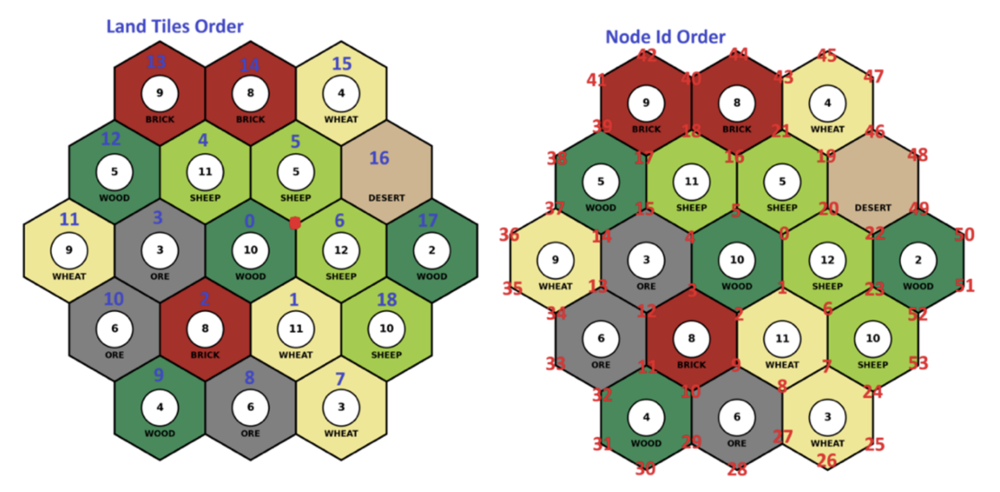
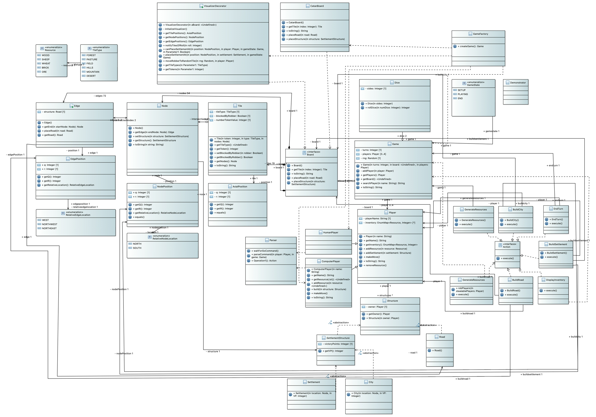

# Catan Game Simulation
 
**Project Tracking:** [Kanban Board](LINK)

**Names:** 
- Michael Mondaini [@SharkieBite](https://www.github.com/SharkieBite)
- Anas Abdul Aal [@Anasthecode](https://github.com/Anasthecode)
- Jack Wyand [@jackwyand](https://github.com/jackwyand)
- Uzair Khan [@UzairKhan12112005](https://github.com/UzairKhan12112005)

**Date:** March 5th, 2026
**Course:** SFWRENG 2AA4 - Software Design I - Introduction to Software Development

[](https://sonarcloud.io/summary/new_code?id=Anasthecode_2AA4-Catan-Game)

---------------------------------------------------------

This is the repository for a Java-based Catan simulation made for the SFWRENG 2AA4 (Software Design I) course at McMaster University. 

The simulation engine runs a full game between a mix of human and computer-controlled agents, strictly enforcing the invariants defined by the official Catan rulebook (including distance rules, connection rules, and resource costs). The game is driven by a Finite State Machine (`SETUP`, `PLAYING`, `END`) and features a robust Command Line Interface (CLI) that parses human input using Regular Expressions. Furthermore, the engine uses the Decorator design pattern to silently intercept board updates and export the live game state to JSON, allowing for real-time graphical rendering via a Python visualizer.

## How to Run the Project

To fully evaluate the interactive CLI and the live visualizer, you will need to run the Java engine and the Python visualizer simultaneously in two separate terminal windows.

**Step 1: Start the Java Game Engine**
1. Open the project in your preferred IDE (IntelliJ/Eclipse) or compile via Maven.
2. Ensure your working directory is set to the root of the project (so the relative file paths for the JSON export work correctly).
3. Run the main method located in: `src/main/java/com/team22/catan/game/Demonstrator.java`
4. Follow the CLI prompts in the console to take your turn as the Human player.

**Step 2: Start the Live Python Visualizer**
1. Open a new terminal window.
2. Navigate to the visualizer directory: `cd assignments/visualize/`
3. Activate your Python virtual environment if required.
4. Run the visualizer in watch mode: 
   ```bash
   python light_visualizer.py base_map.json TestingState.json --watch

## Functionality of the program:
- **Interactive CLI:** Allows a human player to interact with the game using natural text commands (e.g., `Build settlement 12`, `Roll`, `Go`, `List`).
- **Live Board Visualization:** Seamlessly exports the internal Java object state (Nodes, Edges, Owners) into a `TestingState.json` file to be rendered by the Python `catanatron` visualizer.

## Board Layout & Coordinate System

Below is the mapping of our axial coordinate system, showing the specific Node IDs and Edge connections used by the engine and visualizer. When using the CLI (e.g., `Build settlement 12`), refer to this map for valid Node IDs.



## UML Class Diagram

Below is the architectural design of the game engine, highlighting the core patterns used to satisfy the Assignment 2 requirements (including the `VisualizerDecorator`, the Action/Command classes, and the `GameState` machine).


- **Rule Enforcement:** Validates all moves, preventing floating settlements, overlapping roads, or building without sufficient resources.
- **The Robber Mechanism:** Automatically triggers on a dice roll of 7, forcing players with more than 7 cards to discard half their hand, and allowing the roller to steal a random resource from an adjacent player.
- **Automated Opponents:** Computer agents dynamically assess the board state and randomly execute valid actions until a player reaches the victory point threshold.

# Assignment 2 Checklist

## Technical content
- [x] Every task in the assignment addressed
- [x] Human player integrated (R2.1)
- [x] Step forward / `Go` functionality implemented (R2.4)
- [x] Robber mechanism implemented (R2.5)

## Delivery

### Software
- [x] Requirements addressed
- [x] Software properly tested (JUnit Boundary/Partition testing)
- [x] Demonstrator implemented and documented
- [x] Visualizer integration works seamlessly without crashing

### Management
- [x] SonarQube analysis linked in the README file
- [x] Kanban board maintained and publicly available
- [x] Commits linked to work items 
- [x] Deliverable tagged in Git

### Report
- [x] Reflection points elaborated (OO design, SOLID principles, Automata)
- [x] Report written
- [x] Report submitted
